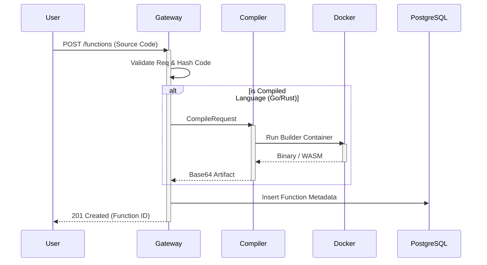
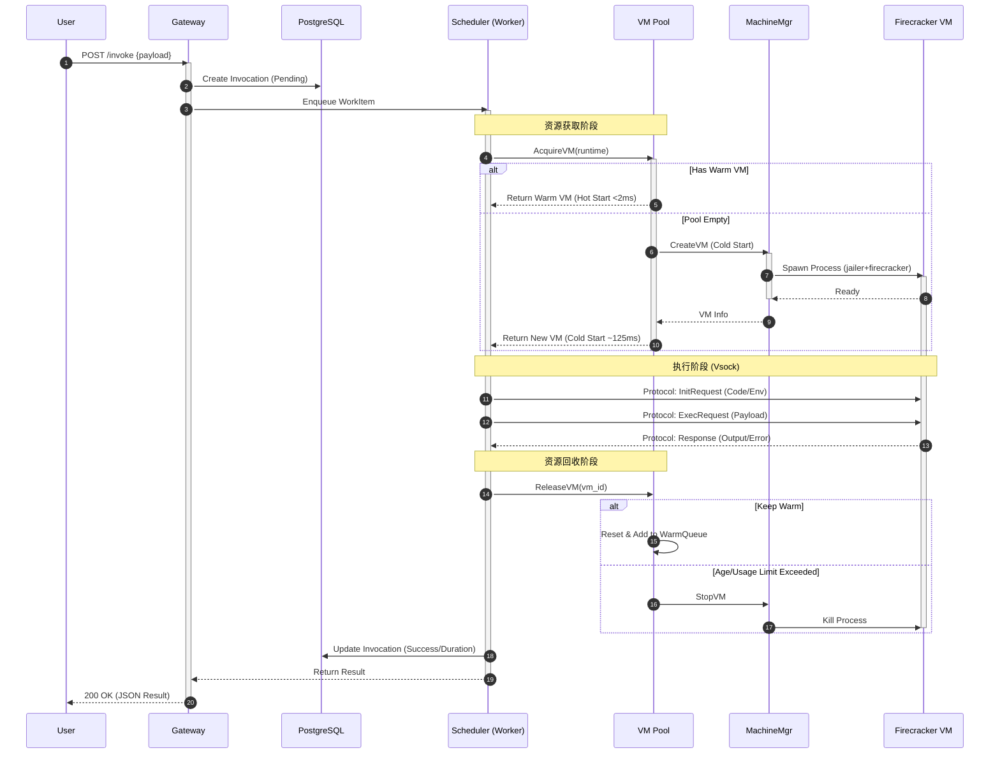
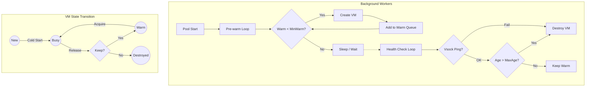

# 核心流程图 (Workflows)

本文档通过图表展示 Nimbus 平台的关键工作流程，包括函数创建、同步/异步调用以及虚拟机池管理。

## 1. 函数创建与编译流程 (Function Build Flow)

## 2. 函数同步调用流程 (Sync Invocation Flow)

这是平台最核心的流程，展示了请求如何穿透网关、调度器直达 MicroVM。

## 3. 虚拟机池管理逻辑 (VM Pool Lifecycle)

展示后台如何自动维护预热池以降低冷启动。

